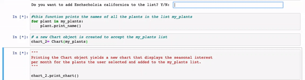

# Plant Visually Beta Version
This is the beta version of the Plant Visually phenological chart generator. The final project can be found here.



## Summary
The first version of the phenological plant chart includes four plants that the user is prompted to add to a list by responding 'yes' or 'no'. A chart is generated using text to display a three letter abbreviation of the plant flower color in the month that the plant is blooming.

## Functional Components

#### MVP
| Component | Priority | Estimated Time | Time Invested | Actual Time |
| --- | :---: |  :---: | :---: | :---: |
| Plant class | H | 2hr | 1hr | 3hr|
| Creation of plant objects  | H | 2hr | 1hr | 3hr|
| Chart class | H | 2hr | 1hr | 3hr|
| Plant selection menu  | M | 2hr| 1hr | 3hr |

| Total |  | 8hrs| 4hr | 12hr |

#### PostMVP
| Component | Priority | Estimated Time | Time Invested | Actual Time |
| --- | :---: |  :---: | :---: | :---: |
| More plant objects, maybe link to a database| H | 8hr | -hr | -hr|
| Printing seasonal interest as a color rather than a text field| M | 8hr | -hr | -hr|
| Using a graphic library to create chart | H | 16hr | -hr | -hr|

| Total | H | 32hrs| -hrs | -hrs |

## Code Snippet
This is the code that I am most proud of, it is an instance method in the class Plant. It loops through the months in a plant object and returns the seasonal interest. In the test case seasonal interest is always a flower and corresponding flower color. This piece of code delivers a key componenent of this project. 

```python
    def print_interest(self):  
        interest_string = " "
        for month in self.months:
            if month in self.interest_for_month:
                interest_string = interest_string + self.interest_for_month[month] + "-"
```


